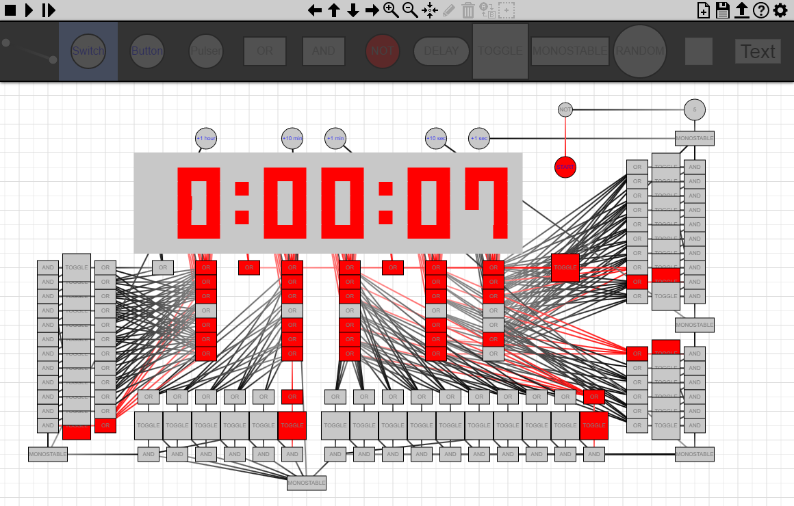

# OldLogicboard
Logic circuit editor and simulator I made in JavaScript in 2016-2017.

**Visit https://github.com/Tomlacko/Logicboard for a complete 2022 remake with much higher code quality and better usability.**

For this old version, expect a lot of jank and bugs, as this was one of my first bigger projects and a lot of it remains unfinished.

---

### Live demo of every version:
#### Early development:
[v0.1](https://tomlacko.github.io/OldLogicboard/v0.1), [v0.2](https://tomlacko.github.io/OldLogicboard/v0.2), [v0.5](https://tomlacko.github.io/OldLogicboard/v0.5), [v0.9](https://tomlacko.github.io/OldLogicboard/v0.9)
#### Working versions:
[v1.0](https://tomlacko.github.io/OldLogicboard/v1.0), [v1.1](https://tomlacko.github.io/OldLogicboard/v1.1), [v1.2](https://tomlacko.github.io/OldLogicboard/v1.2), [v1.3](https://tomlacko.github.io/OldLogicboard/v1.3), [v1.4](https://tomlacko.github.io/OldLogicboard/v1.4), [v1.5](https://tomlacko.github.io/OldLogicboard/v1.5), [v1.6](https://tomlacko.github.io/OldLogicboard/v1.6), [v1.7](https://tomlacko.github.io/OldLogicboard/v1.7)
#### File support added:
[v1.8](https://tomlacko.github.io/OldLogicboard/v1.8), [v1.9](https://tomlacko.github.io/OldLogicboard/v1.9), [v1.10](https://tomlacko.github.io/OldLogicboard/v1.10), [v2.0_0](https://tomlacko.github.io/OldLogicboard/v2.0_0), [v2.0_1](https://tomlacko.github.io/OldLogicboard/v2.0_1), [v2.0_2](https://tomlacko.github.io/OldLogicboard/v2.0_2), [v2.1](https://tomlacko.github.io/OldLogicboard/v2.1), [v2.2](https://tomlacko.github.io/OldLogicboard/v2.2), [v2.3](https://tomlacko.github.io/OldLogicboard/v2.3), [v2.4](https://tomlacko.github.io/OldLogicboard/v2.4)
#### File format version 4:
[v2.5](https://tomlacko.github.io/OldLogicboard/v2.5), [v2.6](https://tomlacko.github.io/OldLogicboard/v2.6)
#### File format version 5:
[v2.7_1](https://tomlacko.github.io/OldLogicboard/v2.7_1), [v2.7_2](https://tomlacko.github.io/OldLogicboard/v2.7_2), [v2.8](https://tomlacko.github.io/OldLogicboard/v2.8), [v2.9](https://tomlacko.github.io/OldLogicboard/v2.9), [v2.10](https://tomlacko.github.io/OldLogicboard/v2.10), [v2.11](https://tomlacko.github.io/OldLogicboard/v2.11), [v2.12](https://tomlacko.github.io/OldLogicboard/v2.12), [v2.13](https://tomlacko.github.io/OldLogicboard/v2.13), [v2.14](https://tomlacko.github.io/OldLogicboard/v2.14), [v2.15](https://tomlacko.github.io/OldLogicboard/v2.15), [v2.16](https://tomlacko.github.io/OldLogicboard/v2.16), [v2.17](https://tomlacko.github.io/OldLogicboard/v2.17), [v2.18](https://tomlacko.github.io/OldLogicboard/v2.18), [v2.19](https://tomlacko.github.io/OldLogicboard/v2.19), [v2.20](https://tomlacko.github.io/OldLogicboard/v2.20), [v2.21](https://tomlacko.github.io/OldLogicboard/v2.21), [v2.22](https://tomlacko.github.io/OldLogicboard/v2.22)
#### File format version 6:
[v2.23](https://tomlacko.github.io/OldLogicboard/v2.23)

---

### Example circuits:
https://github.com/Tomlacko/OldLogicboard/tree/versions/SAVES

(The most interesting one to try would be the computer I have made.)

### Preview image:
Digital clock

